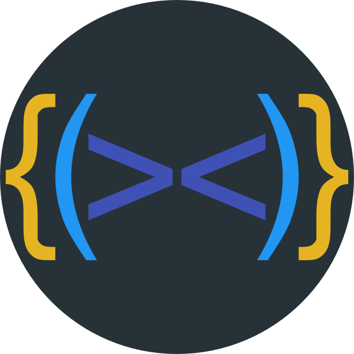
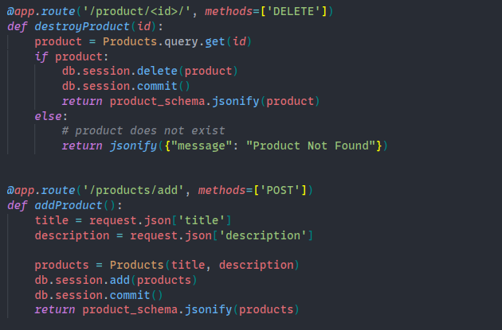
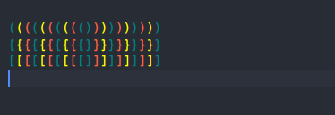
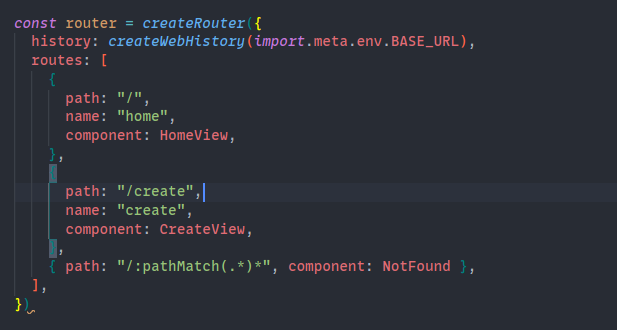
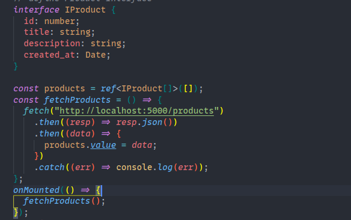
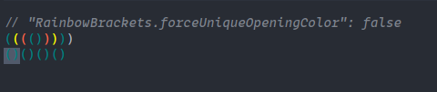
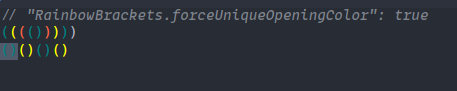
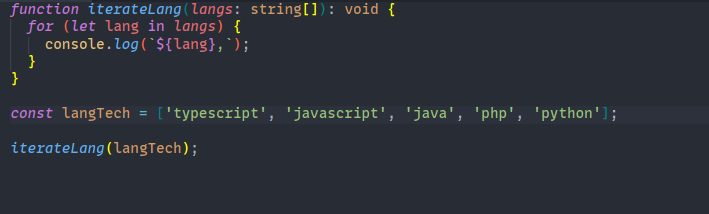

<h1 align="center">
  <br>
    
  <br><br>
 Rainbow Brackets
  <br>
  <br>
</h1>

<h5 align="center">This extension allows matching brackets to be identified with colours. The user can define which characters to match, and which colors to use.</h5>

<p align="center">
    <a href="https://marketplace.visualstudio.com/items?itemName=tal7aouy.rainbow-bracket"></a>&nbsp;
    <a href="https://marketplace.visualstudio.com/items?itemName=tal7aouy.rainbow-bracket"></a>&nbsp;
    <a href="https://marketplace.visualstudio.com/items?itemName=tal7aouy.rainbow-bracket"></a>&nbsp;
    <a href="https://marketplace.visualstudio.com/items?itemName=tal7aouy.rainbow-bracket"></a>
</p>

---

- [Supported languages](#supported-languages)
- [Author's choice](#authors-choice)
- [Install](#install)
- [Screenshots](#screenshots)
- [Settings](#Settings)
- [Commands](#Commands)
- [HTML Configuration](#HTML_Configuration)
- [Release Notes](#CHANGELOG)
- [Issues Suggestions](#Issues&Suggestions)

## Supported languages

Java, Scala, Clojure, Kotlin, Python, Haskell, Agda, Rust, JavaScript, TypeScript, Erlang, Go, Groovy, Ruby, Elixir, ObjectiveC, PHP, HTML, XML, SQL, Apex language, C#, Dart, Pug/Jade, Bash, Vue.js, C# Razor Pages, GLSL(the OpenGL Shading Language), Go Template, C++, C...

## Author's choice

Rainbow Brackets + Theme + Error Lens +[Monolisa](https://www.monolisa.dev/) (Font)

## install

1. Open the extensions sidebar on Visual Studio Code
1. Search for **Rainbow Brackets**
1. Click Install
1. Click Reload to reload your editor
1. 🌟🌟🌟🌟🌟 Rate five-stars 😃

## Screenshots

- Python




- Typescript



- Vue



## Settings

```json
// default is 200
"RainbowBrackets.timeOut":200
```

Configure how long the editor should be idle for before updating the document.

> Set to 0 to disable.

```json
"RainbowBrackets.forceUniqueOpeningColor": true | false
```

>  > 

```json
"RainbowBrackets.forceIterationColorCycle": true
```

> 

### Commands

These commands will expand/undo the cursor selection to the next scope

`"rainbow-brackets.expandBracketSelection"`  
`"rainbow-brackets.undoBracketSelection"`

Quick-start:

```json
	{
		"key": "shift+alt+right",
		"command": "rainbow-brackets.expandBracketSelection",
		"when": "editorTextFocus"
	},
	{
		"key": "shift+alt+left",
		"command": "rainbow-brackets.undoBracketSelection",
		"when": "editorTextFocus"
	}
```

### HTML_Configuration

> An example configuration for HTML is:

```json
    "RainbowBrackets.consecutivePairColors": [
    "()",
    "[]",
    "{}",
    ["teal", "yellow", "tomato"],
    "Revioletd"
  ]
```

`settings.json`

```json
{
  "editor.RainbowBrackets.enabled": true,
  "editor.guides.bracketPairs": "active"
}
```

Screenshot:  


---

## Features

### User defined matching characters

By default (), [], and {} are matched, however custom bracket characters can also be configured.

---

## [CHANGELOG](CHANGELOG.md)

---

## Issues&Suggestions

For any issues or suggestions, please use [GitHub issues](https://github.com/tal7aouy/RainbowBrackets/issues).
